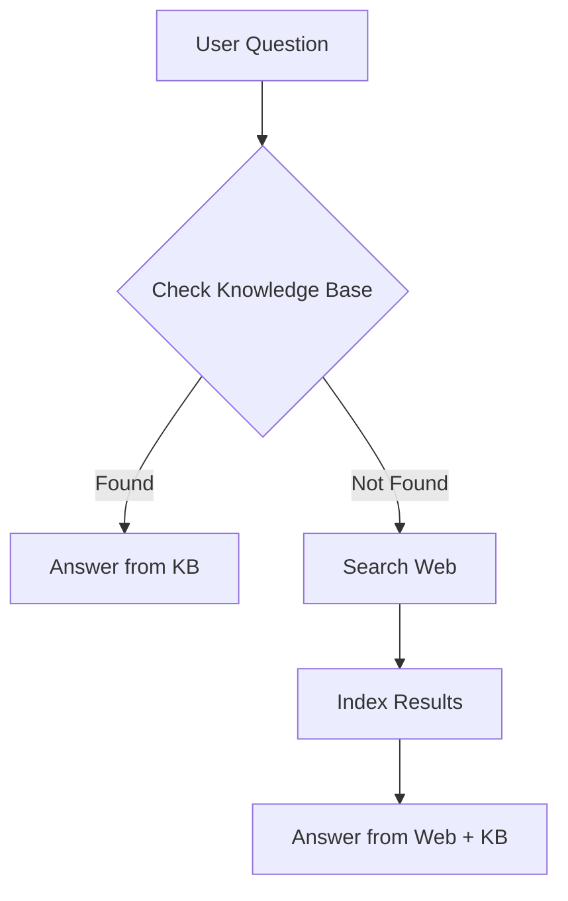

# 🤖 Orchestrator RAG Knowledge Base

> An intelligent, self-learning knowledge base system with automatic web search fallback

## What Makes This Special?

Unlike traditional RAG systems, this uses an **orchestrator agent** that intelligently decides whether to:
1. Answer from your local knowledge base
2. Search the web for current information
3. Automatically save useful findings for future queries

**Result**: A knowledge base that grows smarter over time! 🧠✨

## Key Features

### 🎯 Intelligent Orchestration
- **Smart Routing**: Automatically decides between local KB and web search
- **No Manual Selection**: Single agent handles everything
- **Transparent Process**: Always tells you where info came from

### 🔍 Web Search Integration
- **Free DuckDuckGo Search**: No API key needed for web search
- **Automatic Fallback**: Searches web when KB is insufficient  
- **Auto Indexing**: Saves useful web results automatically

### 💾 Self-Learning System
- **Grows Over Time**: Learns from every web search
- **Persistent Storage**: ChromaDB Cloud keeps everything safe
- **Smart Indexing**: Only saves relevant information

### 🎨 Modern Interface
- Clean, intuitive UI
- Real-time responses
- Upload files or URLs
- Live document count

## Quick Start

```powershell
# 1. Install dependencies (if needed)
uv sync

# 2. Start the application
python start_app.py

# 3. Open browser
# Visit: http://localhost:8000
```

## How It Works

### The Orchestrator's Workflow



### Example Scenarios

#### Scenario 1: Knowledge Base Has Answer
```
You: "What is RAG?"
[If you uploaded docs about RAG]

Agent: 
1. ✓ Checked knowledge base
2. ✓ Found relevant information
3. → Answers from your documents
```

#### Scenario 2: Web Search Needed
```
You: "What's the weather in Tokyo today?"
[No weather data in KB]

Agent:
1. ✓ Checked knowledge base (no results)
2. ✓ Searched web via DuckDuckGo
3. ✓ Indexed useful findings
4. → Answers with current web data
```

#### Scenario 3: Combined Knowledge
```
You: "How does LangChain compare to other frameworks?"
[Some info in KB, needs current data]

Agent:
1. ✓ Found some info in knowledge base
2. ✓ Searched web for latest comparisons
3. ✓ Indexed new findings
4. → Comprehensive answer from both sources
```

## Usage Examples

### Upload Documents
```
1. Click "Choose File"
2. Select PDF or TXT file
3. Automatic indexing begins
4. Check document count increase
```

### Index Web Pages
```
1. Paste URL in input field
2. Click "Add URL"
3. Agent extracts and indexes content
4. Ready for queries
```

### Ask Questions
```
Just type and press Enter!

Examples:
- "Summarize the uploaded documents"
- "What are the latest developments in AI?"
- "Explain quantum computing"
- "How do I use LangChain?"
```

## Architecture

### Tech Stack
- **Backend**: FastAPI (Python)
- **LLM**: Google Gemini 2.5 Flash Lite
- **Embeddings**: Google text-embedding-004
- **Vector DB**: ChromaDB Cloud
- **Web Search**: DuckDuckGo (free)
- **Agent Framework**: LangChain + LangGraph
- **Frontend**: Vanilla HTML/CSS/JS

### Agent Tools

The orchestrator has 3 main tools:

1. **`retrieve_knowledge`** - Searches local vector store
2. **`search_web`** - DuckDuckGo web search  
3. **`index_new_knowledge`** - Saves findings to vector store

### System Prompt (Simplified)

```
You are an intelligent orchestrator agent.

Workflow:
1. ALWAYS try local knowledge base first
2. If not found, search the web
3. Automatically index useful web findings
4. Cite your sources clearly
```

## API Endpoints

### `POST /api/chat`
Chat with the orchestrator agent

```json
{
  "message": "Your question",
  "stream": false
}
```

### `POST /api/upload/file`
Upload and index a document

```
FormData with 'file' field
Supports: PDF, TXT
```

### `POST /api/upload/url`
Index content from a URL

```json
{
  "url": "https://example.com/article"
}
```

### `GET /api/info`
Get knowledge base stats

```json
{
  "document_count": 42,
  "last_updated": "2025-11-17T..."
}
```

## Configuration

### Environment Variables

Required in `.env`:

```env
# Google Gemini API
GOOGLE_API_KEY=your_key_here

# ChromaDB Cloud
CHROMADB_API_KEY=your_chromadb_key
CHROMADB_TENANT=your_tenant_id
CHROMADB_DATABASE=Rag-Knoeledge

# Optional: LangSmith (for debugging)
LANGSMITH_API_KEY=your_langsmith_key
LANGSMITH_TRACING=true
```

### No Additional API Keys Needed!
- ✅ DuckDuckGo search is **free** (no API key)
- ✅ Works out of the box with just Google & ChromaDB keys

## Advantages Over Traditional RAG

| Feature | Traditional RAG | Orchestrator RAG |
|---------|----------------|------------------|
| **Knowledge Source** | Fixed documents only | Documents + Web |
| **Current Info** | Limited to upload date | Always up-to-date |
| **Learning** | Static | Self-learning |
| **User Control** | Manual updates needed | Automatic growth |
| **Fallback** | None | Web search |

## Best Practices

### 1. Build a Strong Base
Upload core documents first to reduce web searches:
```
- Company documentation
- Product manuals
- Research papers
- FAQs
```

### 2. Let It Learn
The agent automatically improves:
- Asks diverse questions
- Web searches get indexed
- Future queries use cached results

### 3. Monitor Growth
Check document count regularly:
- Initial: Your uploaded docs
- After use: + auto-indexed web results
- Growth = learning!

### 4. Trust the Process
The orchestrator is smart:
- Prefers local knowledge (faster, private)
- Only searches web when needed
- Automatically saves useful findings

## Troubleshooting

### Web Search Not Working
```powershell
# Reinstall duckduckgo-search
uv add --force duckduckgo-search
```

### No Documents Being Indexed from Web
- Check terminal output for tool calls
- Verify ChromaDB connection
- Ensure agent is using `index_new_knowledge` tool

### Slow Responses
- Web searches take longer than local retrieval
- First query on a topic is slowest
- Subsequent queries use cached results (faster)

## Future Enhancements

Possible additions:
- [ ] Multiple web search sources (Google, Bing)
- [ ] Document relevance scoring
- [ ] Query classification for better routing
- [ ] Usage analytics and learning metrics
- [ ] Export/import knowledge base
- [ ] Multi-language support

## Credits

Built with:
- **LangChain** - Agent framework
- **LangGraph** - Agent orchestration  
- **Google Gemini** - LLM and embeddings
- **ChromaDB** - Vector database
- **DuckDuckGo** - Web search
- **FastAPI** - Backend framework

## License

MIT License - Free to use and modify

---

**🎉 Enjoy your self-learning knowledge base!**

*Questions? Check the logs or open an issue.*
